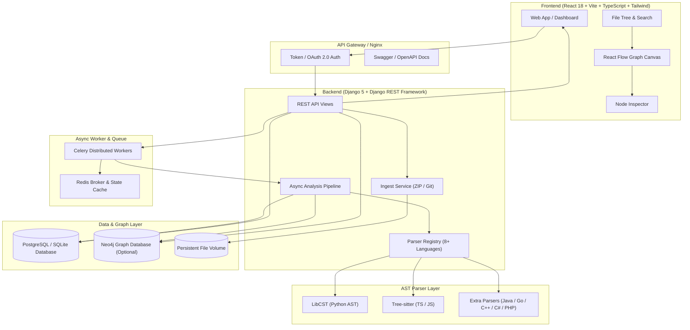

# 🔭 CodeScope

> **Interactive Codebase Visualization & Architecture Intelligence Platform**  
> *Transform any codebase into living, interactive dependency and architecture graphs in seconds.*

[](https://vercel.com)
[](https://render.com)
[](https://www.djangoproject.com/)
[](https://react.dev/)
[](https://www.typescriptlang.org/)
[](https://www.postgresql.org/)
[](https://neo4j.com/)
[](https://docs.celeryq.dev/)
[](https://redis.io/)
[](https://tailwindcss.com/)

---

## 🌐 Live Deployment & Demo

| Service | Status | Link |
|---|---|---|
| **Frontend Web App** | 🟢 Live | [Launch CodeScope App](https://codescope.vercel.app) *(or your deployed Vercel URL)* |
| **Backend REST API** | 🟢 Live | [API Root & Health Check](https://codescope-api.onrender.com/api/v1/health/) |
| **Swagger / OpenAPI Docs** | 🟢 Live | [Interactive API Documentation](https://codescope-api.onrender.com/api/docs/) |
| **GitHub Repository** | 🟢 Active | [GitHub Repo](https://github.com/souhardya004/GDG-infinityloop) |

> 💡 **Hackathon Judges Quick Start**: You can explore the platform with **One-Click Demo Access** without configuring any OAuth keys or credentials! Simply click **"Explore as Guest / Demo"** on the login screen.

---

## 💡 The Problem & Our Solution

### The Challenge
Modern software projects often grow into complex networks of hundreds of files, thousands of functions, circular import dependencies, and layered class hierarchies.
- **Onboarding friction**: New engineers spend days reading directory trees trying to mentally map dependencies.
- **Hidden architectural debt**: Circular dependencies and spaghetti call flows stay invisible until runtime outages occur.
- **Code reviews & refactoring blindspots**: Understanding the blast radius of a class or function change requires tedious manual grep/IDE navigation.

### The Solution: CodeScope
**CodeScope** is an automated **Architecture Intelligence & AST Visualization Engine**. It ingests any codebase via GitHub URL or ZIP upload, extracts deep Abstract Syntax Trees (AST) using **Tree-sitter** and **LibCST**, constructs comprehensive knowledge graphs, and renders high-performance, interactive, multi-view diagrams with real-time symbol search and inspector metrics.

---

## ✨ Key Features

### 🚀 1. Seamless Multi-Source Ingestion
- **One-Click GitHub Ingestion**: Paste any public or private GitHub repository link and branch name to automatically clone, parse, and analyze.
- **Drag-and-Drop ZIP Upload**: Securely upload local project archives with zip-slip safety verification and rapid extraction.

### 🗺️ 2. Six Dynamic Graph Perspectives
Switch effortlessly across 6 specialized architectural views to answer specific engineering questions:
1. **Architecture View**: The complete bird's-eye view mapping files, classes, methods, and functions across the entire repository.
2. **Dependency Graph**: Cross-module import chains, external package linkages, and circular dependencies.
3. **Call Graph**: Function-to-function invocation paths, recursive calls, and async/await execution flows.
4. **Class & Inheritance Graph**: OOP hierarchies, inheritance trees, interfaces, and base class relationships.
5. **Module Map**: High-level module boundaries and package containment.
6. **Folder Structure**: File system directory nesting with synchronized file tree navigation.

### 🔬 3. Polyglot AST Parsing Engine
Extracts semantic symbols (classes, functions, methods, imports, docstrings, line numbers, async signatures) across 8+ languages:
- 🐍 **Python** (via LibCST & Python AST with full type and decorator awareness)
- 🟦 **TypeScript & TSX** (via Tree-sitter)
- 🟨 **JavaScript & JSX** (via Tree-sitter)
- ☕ **Java**, 🐹 **Go**, 🔷 **C#**, ⚙️ **C / C++**, 🐘 **PHP**

### 🎨 4. Rich Interactive Canvas & Inspector Drawer
- **Dynamic React Flow Canvas**: Pan, zoom, drag, and toggle mini-map or force layouts.
- **Live Search & Fuzzy Filtering**: Filter nodes in real time by name, file path, symbol kind, or signature.
- **Deep Node Inspector**: Click any node to reveal exact line start/end ranges, qualified names, docstrings, return types, and file origins.
- **Source File Tree Explorer**: Navigate the directory tree alongside the active graph without losing context.

### ⚡ 5. Dual-Engine Graph Persistence
- **Neo4j Graph Database**: Enterprise-grade graph queries for large repositories with Cypher traversal.
- **Zero-Dependency Postgres Snapshots**: Seamless automatic fallback to JSON snapshot storage in PostgreSQL/SQLite for high availability and zero setup friction.

### 🔐 6. Enterprise-Ready Authentication & Security
- **OAuth 2.0 Integration**: Sign in with **GitHub** or **Google**.
- **JWT / DRF Token Authentication**: Secure token-based session management.
- **One-Click Demo Mode**: Instant access for hackathon evaluators without third-party auth prerequisites.
- **Strict Multi-Tenant Isolation**: Projects and graph datasets are privately scoped per user.

---

## 🏗️ System Architecture



---

## 🛠️ Technology Stack

| Layer | Technology | Description |
|---|---|---|
| **Frontend UI** | **React 18**, **TypeScript**, **Vite** | Modern, lightning-fast Single Page Application (SPA) |
| **Graph Visuals** | **@xyflow/react (React Flow)**, **Cytoscape**, **D3** | GPU-accelerated interactive canvas, minimap, drag & drop layouts |
| **Styling & Motion** | **Tailwind CSS**, **Framer Motion**, **Lucide Icons** | Glassmorphism, sleek dark theme, responsive design |
| **Backend API** | **Django 5.1**, **Django REST Framework** | Robust REST API with auto-generated Swagger schema |
| **AST Parsers** | **Tree-sitter**, **LibCST**, Python AST | High-precision language parsing and symbol extraction |
| **Async Processing** | **Celery 5.4**, **Redis 5.2** | Distributed background tasks with stage-by-stage event updates |
| **Databases** | **PostgreSQL**, **SQLite**, **Neo4j 5.26** | Relational relational models + native graph database traversal |
| **Deployment & Ops** | **Docker**, **Docker Compose**, **Render**, **Vercel** | Production multi-container orchestration & cloud deployment |

---

## 📂 Project Structure

```
codescope/
├── backend/                        # Django 5 + DRF Backend Application
│   ├── apps/
│   │   ├── analysis/               # Multi-stage parsing pipeline & Celery jobs
│   │   ├── authentication/         # GitHub, Google OAuth, Token Auth, Demo login
│   │   ├── core/                   # Language detectors, global exceptions, health check
│   │   ├── graphs/                 # Neo4j client, snapshots, and graph builder services
│   │   ├── parsers/                # Tree-sitter & LibCST language plugin registry
│   │   │   └── languages/          # Python, TS, JS, Java, Go, C#, C++, PHP parsers
│   │   └── projects/               # Project management, file ingestion, storage
│   ├── config/                     # Django settings, URL routing, Celery config
│   ├── Dockerfile                  # Production backend container definition
│   ├── requirements.txt            # Python dependencies
│   └── manage.py                   # Django CLI
│
├── frontend/                       # React 18 + Vite + TypeScript Frontend
│   ├── src/
│   │   ├── components/             # DependencyGraph (React Flow), FileTree, AppShell
│   │   ├── context/                # AuthContext & Session management
│   │   ├── pages/                  # HomePage, LoginPage, Dashboard, ProjectExplorer
│   │   ├── lib/                    # API client with auto token attachment
│   │   └── types/                  # TypeScript interface contracts for API models
│   ├── package.json                # Node dependencies
│   ├── tailwind.config.js          # Tailwind CSS styling configuration
│   └── vite.config.ts              # Vite bundle configuration
│
├── docker-compose.yml              # Local multi-service development compose
├── docker-compose.prod.yml         # Production multi-service container orchestration
├── render.yaml                     # Render Blueprint specification (API + Worker + DB + Redis)
└── README.md                       # Project documentation
```

---

## ⚡ Quickstart & Local Setup

### Option 1: One-Command Setup with Docker (Recommended)

Run the full stack with all services (Frontend, Backend, PostgreSQL, Redis, Neo4j) configured out of the box:

```bash
git clone https://github.com/souhardya004/GDG-infinityloop.git
cd codescope

docker compose up --build
```

- 🖥️ **Frontend UI**: [http://localhost:5173](http://localhost:5173)
- 📖 **API & Swagger Docs**: [http://localhost:8000/api/docs/](http://localhost:8000/api/docs/)
- 🌐 **Neo4j Browser**: [http://localhost:7474](http://localhost:7474) *(User: `neo4j`, Password: `codescope-neo4j`)*

---

### Option 2: Manual Local Development Setup

#### 1. Backend Setup

```bash
cd backend

# Create and activate virtual environment
python -m venv .venv
# On Windows:
.\.venv\Scripts\activate
# On macOS/Linux:
# source .venv/bin/activate

# Install dependencies
pip install -r requirements.txt

# Configure environment
cp .env.example .env

# Apply database migrations
python manage.py migrate

# Run development server
python manage.py runserver 8000
```

*(Optional)* Run Celery worker for async task processing:
```bash
celery -A config worker -l INFO
```
> *Note: In `DEBUG=True` mode, tasks run synchronously in-process automatically if Redis is not running.*

#### 2. Frontend Setup

```bash
cd frontend

# Install npm packages
npm install

# Start Vite development server
npm run dev
```

Open [http://localhost:5173](http://localhost:5173) in your browser.

---

## 🚀 Cloud Deployment Guide

CodeScope is designed for zero-hassle cloud deployment with **Render** (Backend API, Celery Worker, PostgreSQL, Redis) and **Vercel** (Frontend SPA).

### Step 1: Deploy Backend on Render
1. Fork or push this repository to GitHub.
2. In the [Render Dashboard](https://render.com), navigate to **New → Blueprint**.
3. Select your repository. Render will automatically read [`render.yaml`](render.yaml) and spin up:
   - `codescope-api`: Django Web Service (Gunicorn)
   - `codescope-worker`: Celery Background Worker
   - `codescope-db`: Managed PostgreSQL database
   - `codescope-redis`: Managed Redis instance
4. Once deployed, note your Render Web Service URL (e.g. `https://codescope-api.onrender.com`).
5. Under `codescope-api` **Environment Settings**, set:
   - `CORS_ALLOWED_ORIGINS`: `https://your-frontend.vercel.app`
   - `CSRF_TRUSTED_ORIGINS`: `https://your-frontend.vercel.app`
   - `CORS_ALLOWED_ORIGIN_REGEXES`: `^https://.*\.vercel\.app$`

### Step 2: Deploy Frontend on Vercel
1. In the [Vercel Dashboard](https://vercel.com), click **Add New Project** and import this repository.
2. Set **Root Directory** to `frontend`.
3. Set Framework Preset to **Vite**.
4. Add the Environment Variable:
   - `VITE_API_BASE_URL` = `https://<your-render-api-subdomain>.onrender.com/api/v1`
5. Click **Deploy**. Single-page routing is automatically handled via [`frontend/vercel.json`](frontend/vercel.json).

---

## 📡 REST API Reference

CodeScope features a fully documented REST API. Interactive Swagger / OpenAPI documentation is available at `/api/docs/`.

| Method | Endpoint | Description |
|---|---|---|
| `GET` | `/api/v1/health/` | Liveness and health check endpoint |
| `POST` | `/api/v1/auth/demo/` | Instant guest/demo login token generation |
| `POST` | `/api/v1/auth/login/` | Authenticate with username/email & password |
| `POST` | `/api/v1/auth/github/` | Exchange GitHub OAuth authorization code |
| `POST` | `/api/v1/auth/google/` | Exchange Google OAuth authorization code / ID token |
| `GET` | `/api/v1/projects/` | List all projects belonging to the authenticated user |
| `POST` | `/api/v1/projects/` | Create a new project workspace |
| `POST` | `/api/v1/projects/{id}/ingest/zip/` | Upload and extract a ZIP codebase archive |
| `POST` | `/api/v1/projects/{id}/ingest/github/` | Clone and ingest a GitHub repository branch |
| `GET` | `/api/v1/projects/{id}/jobs/{job_id}/` | Poll real-time status and stage of an analysis job |
| `GET` | `/api/v1/projects/{id}/files/tree/` | Retrieve hierarchical file and folder directory tree |
| `GET` | `/api/v1/projects/{id}/graphs/{type}/` | Fetch graph nodes and edges (`architecture`, `dependency`, `call`, `class`, `module`, `folder`) |
| `POST` | `/api/v1/projects/{id}/graphs/rebuild/` | Force re-parse and regenerate all graph views |
| `GET` | `/api/v1/plugins/` | List active language parser plugins and capabilities |

---

## 🧩 Supported Language Parsers

| Language | File Extensions | Parser Engine | Extracted Features |
|---|---|---|---|
| **Python** | `.py`, `.pyi` | LibCST & Python AST | Classes, functions, methods, async signatures, docstrings, imports, call flows, inheritance |
| **TypeScript** | `.ts`, `.tsx`, `.mts`, `.cts` | Tree-sitter | Interfaces, classes, methods, exported functions, module imports, TSX components |
| **JavaScript** | `.js`, `.jsx`, `.mjs`, `.cjs` | Tree-sitter | ES6 modules, CommonJS `require`, classes, arrow functions, React components |
| **Java** | `.java` | Tree-sitter & Regex Heuristics | Package declarations, imports, class hierarchies, methods |
| **Go** | `.go` | Tree-sitter & Syntax Extractor | Packages, imports, struct declarations, functions, methods |
| **C#** | `.cs` | Syntax Extractor | Namespaces, classes, interfaces, methods, `using` directives |
| **C / C++** | `.cpp`, `.cc`, `.cxx`, `.h`, `.hpp` | Syntax Extractor | Header includes, class declarations, functions |
| **PHP** | `.php` | Syntax Extractor | Namespaces, `use` statements, classes, functions |

---

## 🛣️ Roadmap & Future Innovations

- [ ] **AI-Powered Codebase Q&A**: Integrate LLMs (e.g. Gemini 2.0 / Flash) with graph RAG to answer queries like *"Which functions are impacted if I change this model?"*.
- [ ] **Automated Architecture Drift Detection**: Alert developers when new PRs violate architectural boundaries or introduce circular dependencies.
- [ ] **GitHub Action Integration**: Generate visual architecture diffs on Pull Requests automatically in CI/CD.
- [ ] **Interactive Code Editing & Sandbox**: Edit and test code snippets directly within the graph view.

---

## 👥 Authors & Acknowledgements

Developed with ❤️ for the **Google Developer Groups (GDG) Hackathon**.

- **Souhardya** ([@souhardya004](https://github.com/souhardya004))

---

## 📄 License

This project is licensed under the [MIT License](LICENSE).
